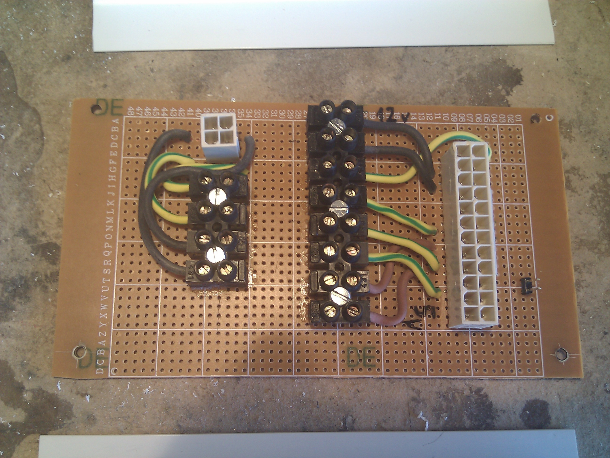
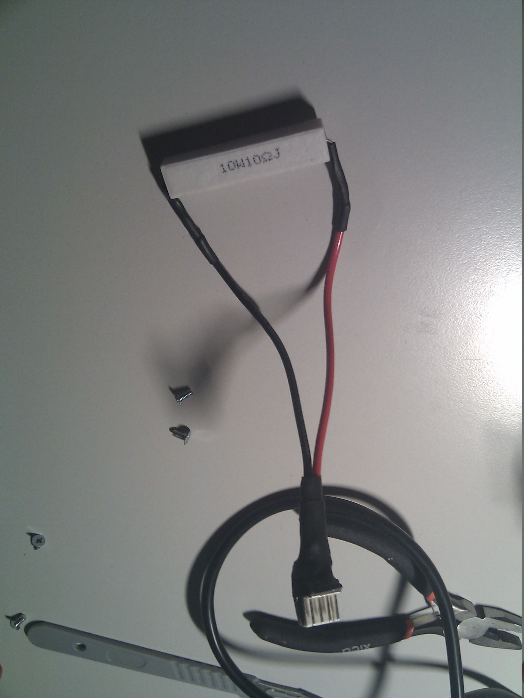
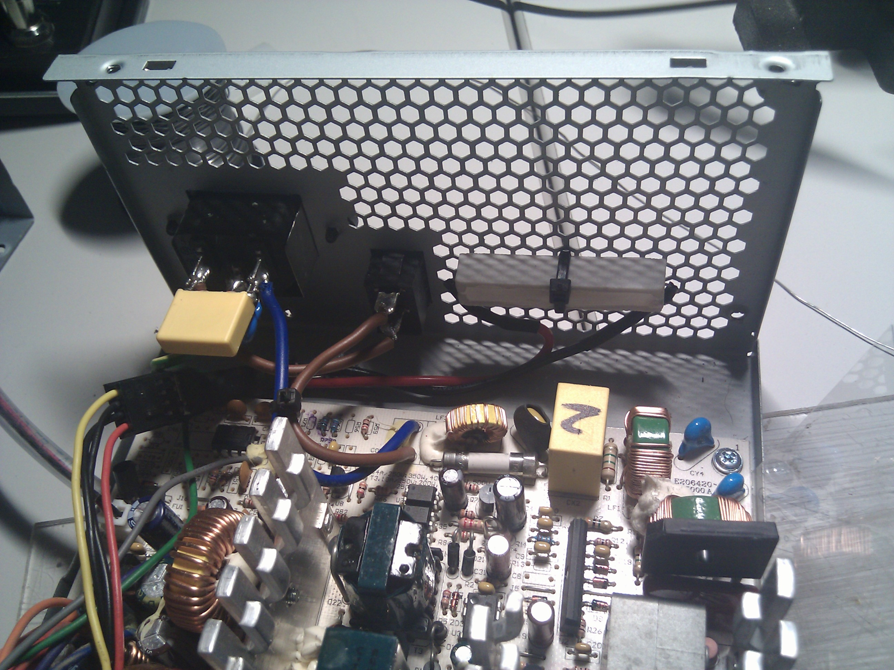

Overview
===
I'm using an AT PC 350W PSU, hopefully it will keep up required Amps without issues, the only issue might be 
possible voltage drops or waveform quality because PC PSUs are not known for their quality or efficiency.
Here's a collection of photos documenting current work.

From a stock PowerSupply I have taken out this cable with +12v, +5v, PS-ON, PG and GND wires.
3.3v and negative voltages are not needed in this project

The 4 Pin motherboard addon cable also supplies 2 12v additional lines, I have connected it as well to get more Amps later on

## Adapting ATX Power Supply Unit (PSU)
- To keep PC ATX PSU (now on named just PSU) always on without a computer motherboard there're a lot of resources across internet. I have read this useful [instructables article](http://www.instructables.com/id/ATX--%3E-Lab-Bench-Power-Supply-Conversion/) even if I have always used these PSUs for my home bench lab
- If you have an ON/OFF switch on the back (usually found in lots of them in the latest 10-15 years) just keep it where it is, it should be the main ON/OFF switch for the whole system
- PS-ON (Power Supply On) cable, the green wire, should be grounded to keep PSU always on, I have used a dip switch with a closed jumper to keep the PSU on, see this picture from [motherboard box section](../motherboard.box/) 

-  PG (Power Good) cable **[Optional]**. The Grey wire gets a stable 5V voltage to show a continuous power coming from your PSU (ence the Power Good name), it doesn't carry Amps but you may use this voltage to power on a common Led. It's not needed but if you'd like to have an extra led with good power state is nice to add it as showed from the circuit on the right
- **Constant load resistor addon**, this seems to be a common discussion argument. A power supply should stay on when PS-ON cable is shorted to ground as previously verified. It seems there's no need to add a resistor between 5V and ground to keep it working, at least it seems that latest/newer PSUs will always keep their voltage without shutting themself down when there's no need (no load) on theyr power lines. Older Power Supply always have this kind of limitation. Even if I'm using a chinese power supply without any limitation I have seen my PSU have some sort of floating voltage, nothing huge but a small floating voltage is always there. After adding a 10&ohm; 10W resistor between 5V and ground this "float" disappears. So: if you don't know what to do always keep a 10&ohm; 10W resistor between 5V (any line is fine) and ground. 
**WARNING:** this resistor generates a lot of heat so you need to be prepared to dissipate it, lay it on the PSU aluminium frame, on the bM3tal frame or whatever you prefer but keep it as cool as possible, you have been warned !
- I'd like to redispose this PSU in case the printer won't work as planned, so, to avoid PSU mods I have created a 10&ohm; resistor load with a simple connector as shown in this image
 
- As you can see I have attached it to the cage inside the PSU case so it can even take proper air ventilation

- As shown from the picture above always use thick cables, these cables have to carry ~20A at 12V so it's better to use quality cables
  
## [Creating an Arduino Power Cable](02.arduino.power.cable.md)
