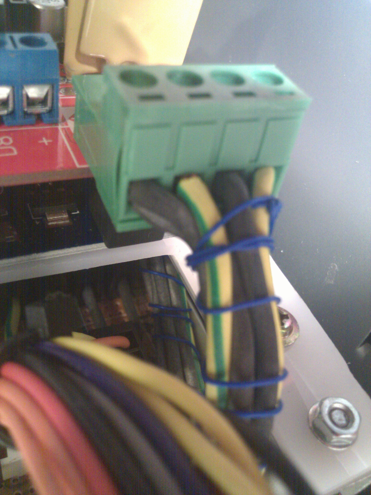

# Supplying power to Arduino and RAMPS shield
There are several ways to power and arduino board and its shields. While using an USB cable is enough when you need to test it or to upload the firmware most of the times is better to use arduino dedicated power cable. In this particular case I'm using a RAMPS 1.4 shield which already has its own power adapter, it can power: the RAMPS board itself, Arduino, motors and every connected sensor.

## RAMPS specs

On the bottom left of the image there's the connector. I'm using 12V lines from my PSU but _11A_ **and** _5A_ are a lot of Amps. To avoid troubles with cables thickness and possible overheating I have decided to double them and get proper voltage and current from each single line coming from my [PSU board](01.PSU-arduino-shield.md). Down below you can see a picture of what I did with it. Image is a little bit blurred but it's OK, the blue cable is just grouping all these cables, it's not necessary at all

## RAMPS Setup
if your power cable is working you can either try to [upload a firmware](../software/README.md) on Arduino or you can continue to configure the RAMPS board. **WARNING:** before doing it it's necessary to turn the power off, when set [proceed to next section](03.stepper.motors.md)