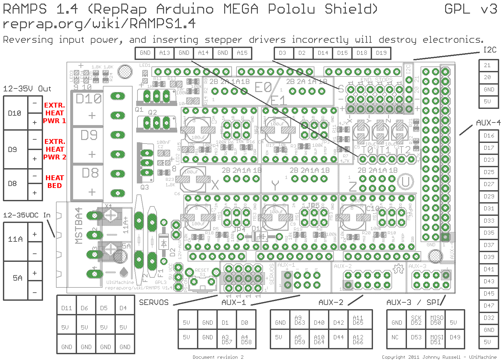
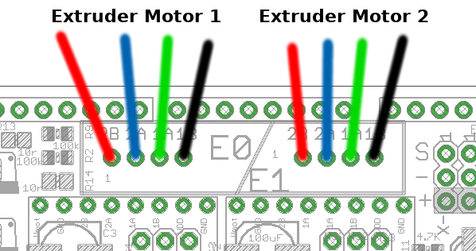
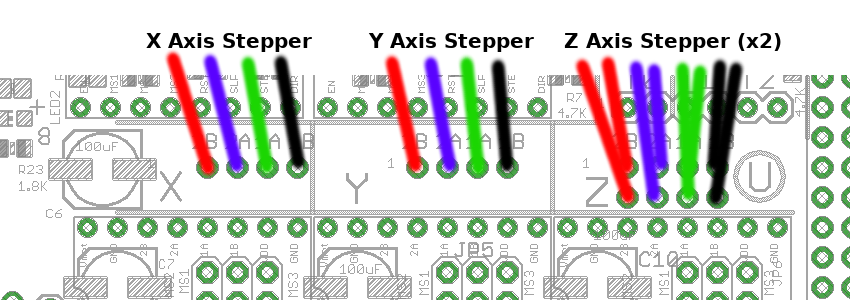
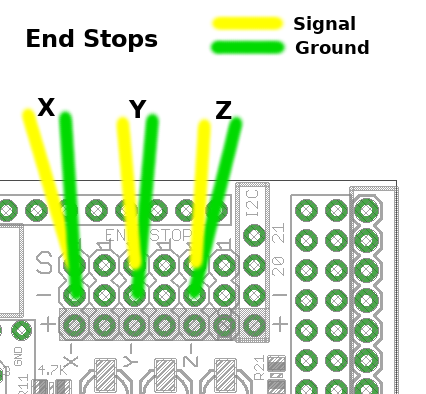
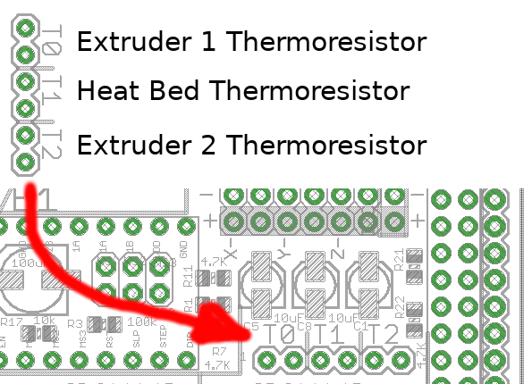
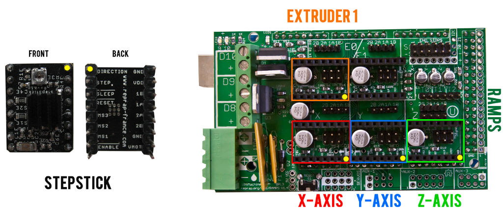
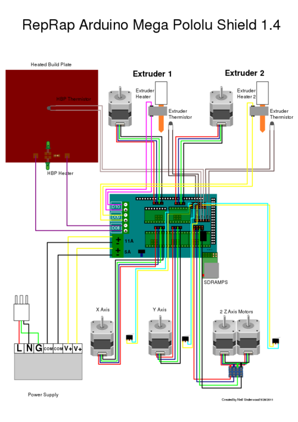

# Configuring RAMPS board
**WARNING:** _Turn off the power supply and disconnect even the USB cable before doing it. Changing configurations when power is supplied might blow the board._
<br/><br/>


and here is where all sensors must be conntected to get a working setup

## Extruder Motors


## X-Y-Z Axis Motors


## End Stop Sensors
<br/>
This is RAMPS general pinout, signal pin is first from top. With current endstops (see [BOM](../../BOM.md) list) each single pin is used because they need power to turn on the led. Green Cable is signal, red and black are power and ground respectively, connect them properly before turning on the RAMPS board


## Thermoresistors connections


## Stepper Driver Boards
*Jumpers need to be installed under each stepper driver*
```
+-----------------+------------+
| Jumper  Yes/No  | Step Size  |
|  1     2     3  |            |
+-----+-----+-----+------------+
|  no |  no |  no |  full step |
| yes |  no |  no |  half step |
|  no | yes |  no |   1/4 step |
| yes | yes |  no |   1/8 step |
|  no |  no | yes |  1/16 step |  <==== NOW USING THIS ONE ====
| yes |  no | yes |  1/32 step |
|  no | yes | yes |  1/64 step |
| yes | yes | yes | 1/128 step |
+-----+-----+-----+------------+
```
If the jumpers set it to a higher number of micro steps than supported by the driver it will operate at the maximum number of micro steps for that driver.
For now the default is maximum micro stepping (all jumpers installed under drivers), which results in 1/16 micro stepping for A4988 drivers and 1/32 for DRV8825. Although for efficiency and accuracy you should opt for the biggest steps that will yield sufficient resolution. Eg. you don't need 5000 steps per millimeter and [http://www.micromo.com/microstepping-myths-and-realities micro-steps] less than 1/16 have reduced torque per step, reduced accuracy and higher driver load].

Glue the heatsink to the top of the [A4988] chip using the provided pad of double-sided adhesive
Useful image taken from [reprap.org website](http://reprap.org/wiki/Prusa_i3_Rework_Electronics_and_wiring)



---
And here's the final schema with an overview on all connections (original picture taken from RepRap website)



---
External links:
- [reprap RAMPS 1.4 configuration](http://reprap.org/wiki/RAMPS_1.4)

