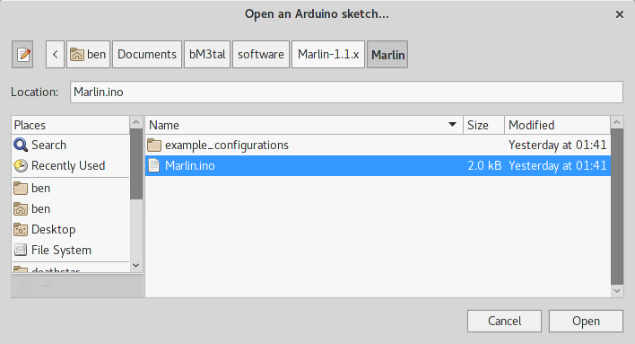
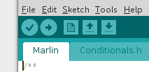

# bM3tal Firmware
Here are steps required for loading bM3tal firmware, this is more a getting started guide and a work in progress for this project.<br/>
**Disclaimer:** Host Setup and configurations are related to a common Linux PC (AMD64), OS-X setup is similar and I guess there aren't huge differences between them. If you're using Windows please refer to common documentation on Arduino setup found on Internet, I don't have Win machines for my tests. Start from [Arduino Website](https://www.arduino.cc/en/Guide/Windows) to get some help for it

---
<br/>

## Prerequisites
- Arduino IDE up and running, now using v1.8.3
- Arduino device drivers (probably) for Windows PCs. I don't really care because I'll stick with Linux and it doesn't need any driver, OS-X doesn't need them too
- Marlin Firmware, latest from https://github.com/MarlinFirmware/Marlin as usual. Get the whole zip from github or clone the repository if you'd like to get more customisation. Now using v1.1
- u8glib from https://code.google.com/archive/p/u8glib/downloads, this project has a LCD 12864 so this library is needed to control the LCD full graphic display. Now using v1.14

---
<br/>
<br/>

## Setup
### Host setup
- Before connecting or using the arduino board and before loading some software on it you need to be sure to have a module loaded, if you're using a general purpose (and mainstream) distribution [Ubuntu, Mint, Fedora, ...] you have them already loaded, if you're compiling your own kernel or if you don't detect the USB port please check these options:
  - Check kernel config or installed drivers, ATMega 2560 requires `(Device Drivers / USB Support / USB Modem (CDC ACM) support)` enabled in the kernel or loaded as a module. In my case I also have FTDI Serial module built in because I usually deal with ATMega 168/328/Tiny85 and so on. If nothing happens load FTDI module as well
  - When kernel is ready or module is loaded you may try to attach the arduino board. Use `dmesg` to see what happens, if ACM support is set and working you might see something like:
    ```
    [  131.776892] usb 1-6: new full-speed USB device number 7 using xhci_hcd
    [  131.947497] usb 1-6: New USB device found, idVendor=2341, idProduct=0042
    [  131.947500] usb 1-6: New USB device strings: Mfr=1, Product=2, SerialNumber=220
    [  131.947501] usb 1-6: Manufacturer: Arduino (www.arduino.cc)
    [  131.947502] usb 1-6: SerialNumber: 01234567890123456789
    [  131.948245] cdc_acm 1-6:1.0: ttyACM0: USB ACM device
    ```
    This means you have the proper board, the proper driver and everything is fine, if you take a look at your device drivers you can see
    ```
    ~ # ls -la /dev/ttyACM0
    crw-rw---- 1 root uucp 166, 0 Jul  6 00:26 /dev/ttyACM0
    ```
  - Be sure to be in the uucp group (or whatever it is called in your system) in order to use the device
- Download Arduino IDE from [Official Web Site](https://www.arduino.cc/en/Main/Software), don't take it from your Distro Repository, it's probably outdated and the latest one from official site is better. Use it and see what happens, if you have troubles with it get a new one from your Distro Repository (with yum, apt-get, emerge, alien or whatever your package manager is called)

### Arduino Libraries: u8glib
- Download the library from its website and unzip it somewhere
- u8glib author is cool but created the .ZIP file with ugly 777 attributes on each single directory (windoze sucks...), for your sanity and a better living chmod these dirs with a safer 755
- Move the unzipped (and chmodded) "U8glib" directory into your arduino libraries directory, something like `mv ~/U8glib /opt/arduino/libraries` (or wherever your arduino libraries are)

---
<br/>
<br/>

## Development Environment
### Arduino Project
- From your Arduino IDE try to connect your PC to the ATMega 2560, from *TOOLS* menu select **Port** and inside it you'll see your newly detected device driver. If *Port* is grayed/disabled restart again from **Host Setup** section
- From *TOOLS* menu select **Board Info**, if everything is fine you'll see a small message box with some information from your board (BN, VID, PID, SN)
- You also need to be sure to have **Arduino/Genuino Mega or Mega2560** selected, go to *TOOLS/board* menu and select it
- From *File/Open* open **Marlin.ino** where you have placed after unpacking
  
- Try to compile the code by clicking the CheckMark button on the left under the *File* menu, if you don't have troubles with your environment you might see something like the screenshot below
  

### Basic Tuning, bare minimal work
- Now it's time to do some tweaking to adapt the Marlin firmware to your RAMPS 1.4 board, go to *Configuration.h* file and start the configuration on it
  - Change `#define BAUDRATE 250000` to a more suitable (and slow) `#define BAUDRATE 115200`, acient computers or small ARM boards (like the RPi) may have problems with higher baud rates. Feel free to keep it back to its original value if everything is fine with your host
  - Remove comment (two leading '//') from
    `#define REPRAP_DISCOUNT_FULL_GRAPHIC_SMART_CONTROLLER`
    to enable *LCD 12864* display supplied with the kit
- Save files and get ready to load this new firmware

---
<br/>
<br/>

## Loading project
**WARNING:** it's better to supply proper voltage to the arduino and RAMPS board *before* going further with these steps, if you didn't already read please take a look at [Electronics Cabling and Power supply](../electronics/README.md)
- From Arduino IDE press the right arrow icon button<br/>
  <br/>
  and in a couple of seconds you might see the compilation process followed by the firmware uploading procedure. In 10-15secs you can see something moving on the display, no matter if you didn't connected motors or anything else. Arduino board should boot and you can see something on your beautiful 12864 LCD full graphic display
- 3D Printer Controller Kit for Arduino Mega 2560 Uno R3 Starter Kits +RAMPS 1.4 + 5pcs A4988 Stepper Motor Driver + LCD 12864 for Arduino Reprap

